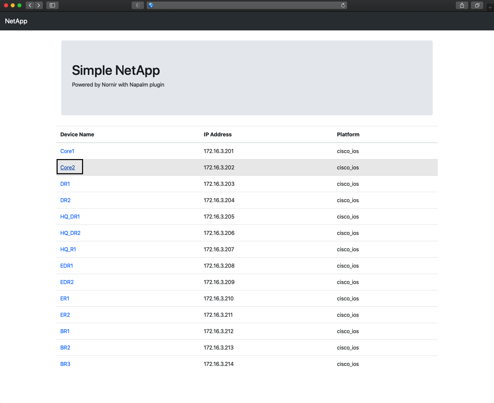
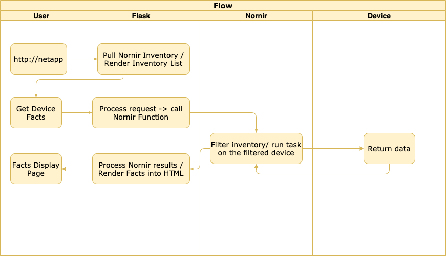

# nornir_flask

This is a very simple app to demonstrate how you can utilize Nornir to write your own Networking WebApp.

Inventory list is generated from Nornir hosts.yaml inventory file and then rendered as HTML Table

Then a url has been crafted to pass the device name as a parameter to the Flask url route decorator which then passes further to the function which calls Nornir get_facts function.
Results then are again rendered in the HTML Table:

## Execution flow

